# Hello!👋 I am Abdullah

I am a computer science and engineering (CSE) and mathematics student at the Massachusetts Institute of Technology (MIT). My areas of interest include performace engineering, computer architecture, operating systems, and security.

I have a good grasp of programming languages like freestanding C, C++, Python, Assembly (x86 and RISC-V), and System Verilog, as well as tools like Linux, Git, scikit-learn (sk-learn), PyTorch, and scipy.

I have relevant work and research experience in the fields of data analysis and computer security, and have contributed to several projects in the past. I am also an honorable mention recipient of the International Mathematical Olympiad (IMO) 2020. You can reach out to me on:

 
   
   
  
  

